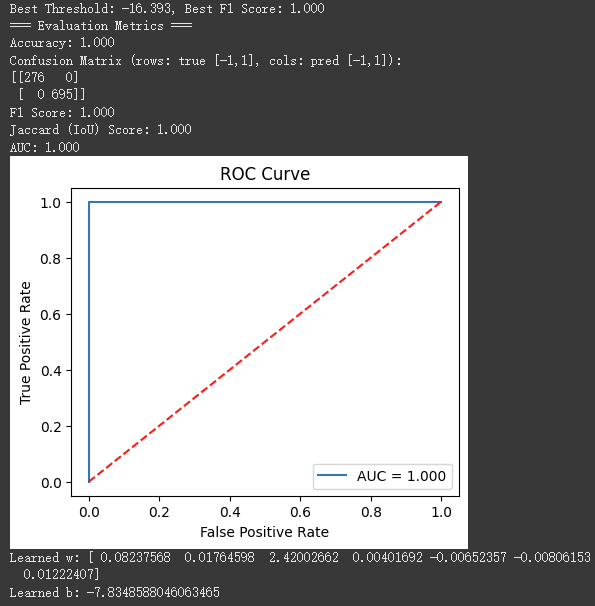

# 3D Point Cloud Perception and Surface Modeling

This project integrates **semantic classification** and **surface modeling** techniques to process real-world 3D point cloud data for robotic applications. It was developed as part of the *41118 Artificial Intelligence in Robotics* coursework at UTS.

## 📌 Project Overview

The full pipeline includes:

1. **Point Cloud Classification**
   - Clustered raw 3D point cloud data using K-Means
   - Extracted principal components using PCA for each cluster
   - Trained a Support Vector Machine (SVM) to classify geometric features (e.g., wall, ground)
   - Evaluated performance using confusion matrix, ROC curve, AUC, and F1 Score

2. **Surface Modeling**
   - Fitted planar surfaces using **Linear Regression (LR)** on segmented clusters
   - Reconstructed complex terrain using **Gaussian Process Regression (GPR)**
   - Incorporated model uncertainty and visualised GP confidence
   - Evaluated performance with **MSE**, **R²**, residuals, and uncertainty calibration

---

## 🧪 Classification Results (SVM)

  

- AUC = 0.999 on test data
- F1 Score = 0.996
- Jaccard Score = 0.992

📊 Full training performance:

  

---

## 📈 Surface Modeling Results

**Linear Regression on segmented wall clusters**:

   
  

**Gaussian Process Regression**:

  

  

📊 GPR Evaluation:
- **MSE**: 0.1053
- **RMSE**: 0.3245
- **Mean predicted uncertainty**: 0.1534

---

## 📂 File Structure

